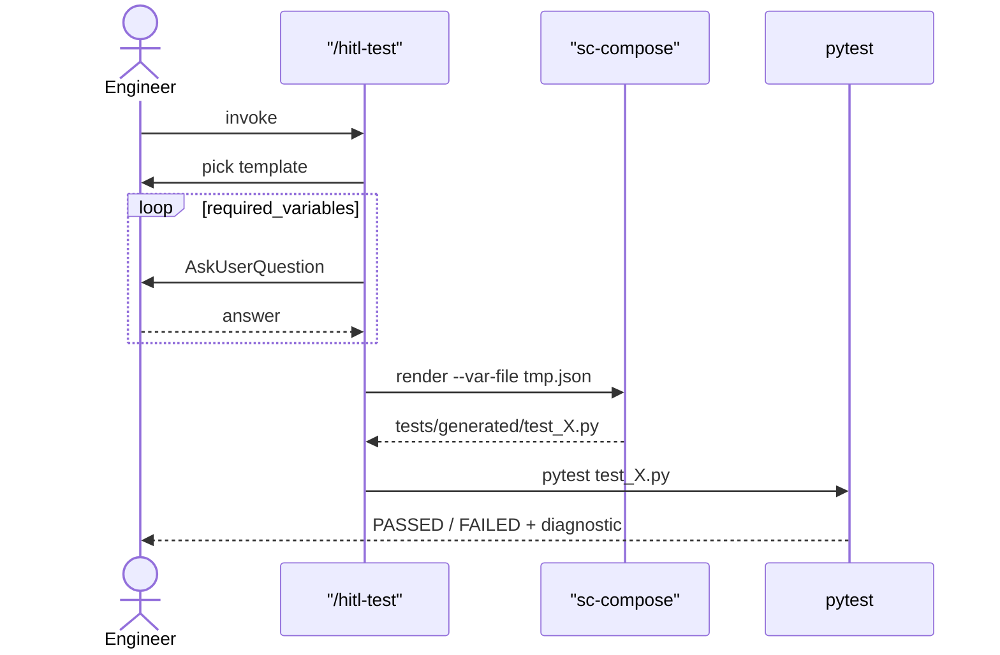

<!--
Rendering this deck:
  npx --yes -p @marp-team/marp-cli marp docs/deck.md -o deck.html
  npx --yes -p @marp-team/marp-cli marp docs/deck.md --pdf -o deck.pdf

Marp itself does not render Mermaid diagrams to SVG — the fenced blocks
come through as code. Options:
  - View the .md on GitHub (renders Mermaid natively)
  - Install a marp + mermaid integration if you need rendered diagrams in PDF/PPTX
  - Present from the HTML in Chrome; works as-is for a screen-share demo
-->

# Agentic HITL Test Generator

A pattern for letting non-programmer test engineers
**run** and **design** real test code through a constrained conversation.

Three layers · Two skills · Mocked hardware

<!-- _paginate: false -->

---

## The problem

- Test engineers know **what** to test; they don't write Python.
- Letting an LLM emit Python from natural language gives:
  - **Drift** — same description, different code every time.
  - **Hidden assumptions** — invented imports, missing `delay_ms`.
  - **No audit** — review 50 files, or trust the prompt.

We want a third path.

---

## What goes wrong with "just let the agent write it"

```
Engineer:  "trigger the camera, check the grid is centered within 2px"

Agent v1:  uses opencv.findCircles
Agent v2:  rolls a custom centroid via numpy.mean
Agent v3:  forgets the display.show() call entirely
Agent v4:  ... last week's prompt worked, this week's doesn't
```

No prompt revision survives contact with reality forever.
The fix is to make the **structure** non-negotiable.

---

## The pattern — three layers

```mermaid
graph TB
    subgraph L3[Layer 3 — Agent skills]
        test["/hitl-test<br/>fill variables in an existing template"]
        author["/hitl-author<br/>compose primitives → new template"]
    end
    subgraph L2[Layer 2 — sc-compose]
        templates["templates/*.py.j2 (full recipes)"]
        primitives["templates/primitives/ (building blocks)"]
        templates -->|@&lt;primitives/...&gt;| primitives
    end
    subgraph L1[Layer 1 — Fixture library]
        lib["hitl_lib/<br/>camera · display · assertions"]
    end
    test -->|renders| templates
    author -->|writes new| templates
    templates -->|generated code calls| lib
```

---

## Layer 1 — `hitl_lib/`

Mock hardware behind a narrow API. Real math.

```python
# hitl_lib/assertions.py (excerpt)
def centroid_within(image, target, tolerance_px):
    total = float(image.sum())
    ys, xs = np.indices(image.shape)
    cx = float((image * xs).sum() / total)
    cy = float((image * ys).sum() / total)
    if math.hypot(cx - target[0], cy - target[1]) > tolerance_px:
        raise AssertionError(
            f"centroid ({cx:.2f}, {cy:.2f}) is {dist:.2f}px from "
            f"target {target}; tolerance was {tolerance_px}px"
        )
```

Mocked at the hardware boundary. Everything else is real.

---

## Layer 2 — templates + primitives kit

**Templates** are full test recipes. **Primitives** are the building blocks templates are composed from.

```jinja
---
required_variables:
  - test_name
  - display_pattern
  - target_x
  - target_y
  - tolerance_px
metadata:
  purpose: "Vision centroid alignment test"
---
@<primitives/setup_preamble.j2>
@<primitives/pattern_capture.j2>
@<primitives/assert_centroid.j2>
```

Kit ships with 4: `setup_preamble`, `pattern_capture`, `assert_centroid`, `assert_intensity`.
sc-compose merges required variables across the include graph automatically.

---

## Layer 3 — `/hitl-test` (the day-to-day path)

```
Engineer: /hitl-test

/hitl-test: Which pattern should the display show?
  ▸ dot_grid — lands ~3.16 px off (100, 100) (Recommended)
    checkerboard — lands ~1.4 px off
    single_dot — lands ~4.2 px off

Engineer: dot_grid

/hitl-test: How many pixels of tolerance?
  ▸ 5 — passes with default jitter (Recommended)
    1 — very tight; fails

Engineer: 5
/hitl-test: Rendered tests/generated/test_grid_centroid.py.
            Run pytest on it now?
```

One `AskUserQuestion` per variable. Engineer never sees Python.

---

## Layer 3 (cont.) — `/hitl-author` (the new-shape path)

**The architectural reason there are two Layer-3 skills, not just two prompts:**

- `/hitl-test` only varies **values** of an existing template.
- `/hitl-author` is the only way to vary **the test's structure** — which checks run, in what order, against what capture.

Engineer picks primitives like building blocks; skill writes a new `templates/<name>.py.j2` with an authoring-trail comment block recording intent + chosen primitives + date. Developer reviews + merges before the new shape becomes available via `/hitl-test`.

If no primitive combination fits: skill refuses to approximate, writes a structured request to `issues/primitive-requests/` instead.

---

## Data flow — `/hitl-test`



---

## The wow moment

Same template. Same engineer. One number changed.

```
$ make demo                              # tolerance_px=5
test_demo_centroid PASSED

$ sc-compose render ... --var-file vars.tight.json   # tolerance_px=1
$ pytest tests/generated/
test_demo_centroid FAILED
  AssertionError: centroid (97.00, 101.00) is 3.16px from
                  target (100, 100); tolerance was 1px
```

The engineer can **feel** the variable through the failure message.

---

## To take this to your domain

1. Replace `hitl_lib/` with your hardware mocks + assertion helpers.
2. Write a handful of **primitives** for your operational concepts (e.g. `roi_select`, `fgr_trigger`, `pixel_variance_check`).
3. Build a few **templates** composing those primitives.
4. Tune both `SKILL.md` files with your variables' defaults.

The discovery, the AskUserQuestion loop, the render-run flow, the authoring trail, the request file — all portable.

**What you keep:** a typed contract, a kit of reviewed building blocks the agent can compose but not bypass, a place each contract is reviewed, and a failure mode that fires before runtime.

---

## Questions?

- Repo: this directory
- Full version: `docs/sop.md`
- Run it yourself:
  - `make demo` (hand-rendered, no agent)
  - `/hitl-test` in Claude Code (consume an existing shape)
  - `/hitl-author` in Claude Code (design a new shape)
