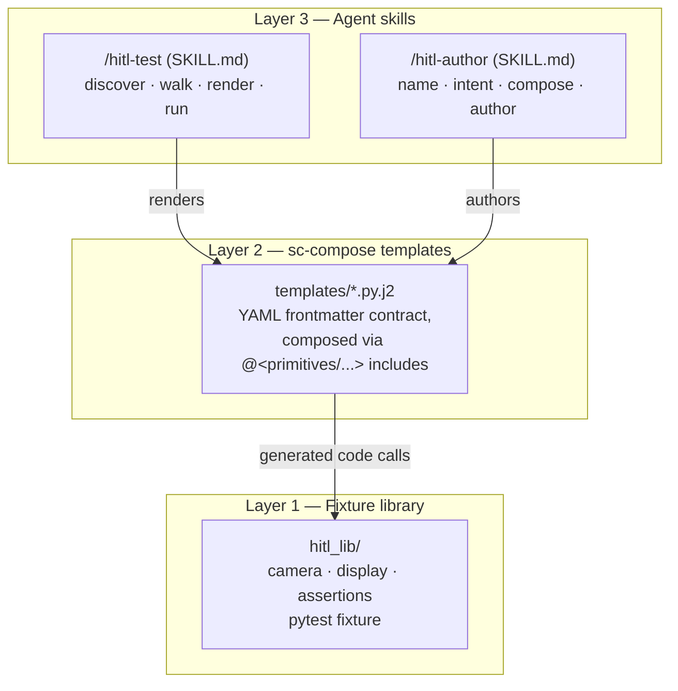
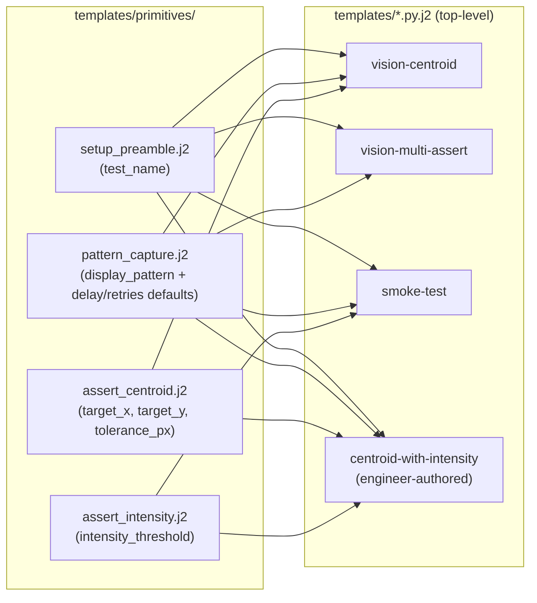
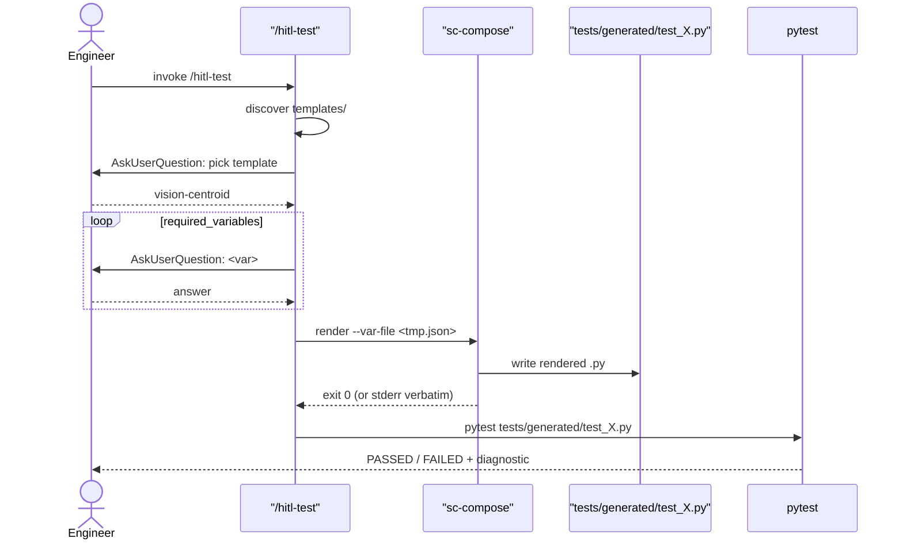

# SOP — Agentic HITL Test Generator

The single reference doc for this repo. Covers both what the project does for a test engineer who doesn't write code and how it works for a developer maintaining it. Sections are ordered so non-programmers can stop reading at [Reading test results](#reading-test-results) and still have the full picture they need; developers continue into [How it works](#how-it-works-the-three-layers) for the architecture.

---

## What this project does

This repository ships two tools you talk to inside Claude Code:

- **`/hitl-test`** — you pick an existing test "shape" and answer a few questions; a real Python test file gets created and run against mocked hardware.
- **`/hitl-author`** — you design a brand-new test shape by combining the available **building blocks** (we call them "primitives" in the code, same thing); a developer reviews what you produced, and once it's merged everyone can use it via `/hitl-test`.

Behind the scenes there's a mocked camera and display so everything runs on a laptop without any physical rig. The patterns, the variables you pick, the pass/fail outcomes — those are real. The fixture math is real. The only mock is the boundary where real hardware would live.

The system's argument: **a test engineer who can describe what they want in five answers should not need to read or write Python**, but letting an LLM agent freely emit Python from natural-language descriptions produces drifting, unreviewable code. The third path — what this repo demonstrates — is a constrained conversation that fills variable slots in a pre-reviewed template, then renders it deterministically.

---

## What a primitive is

A primitive is a **building block** for a test. Each one does one specific thing:

| Primitive | What it does | Variables it needs |
|---|---|---|
| `setup_preamble` | Sets up the test — imports + the test-function declaration. | `test_name` |
| `pattern_capture` | Shows a pattern on the display and snaps a picture with the camera. | `display_pattern` (plus delay/retry defaults) |
| `assert_centroid` | Checks that the bright spot in the picture is near where you expected it. | `target_x`, `target_y`, `tolerance_px` |
| `assert_intensity` | Checks that the picture isn't blank — at least one pixel is bright enough. | `intensity_threshold` |

You assemble these in order: **setup → take a picture → run one or more checks**. That sequence becomes a real test file. You never see Python; the system handles the assembly. Adding a fifth primitive is a developer change — see [When to ask a developer](#when-to-ask-a-developer).

---

## Using `/hitl-test` — render an existing test

In a Claude Code session in this repo, type `/hitl-test`. The skill:

1. Lists every test shape (template) that already exists; you pick one.
2. Asks you the variables that template needs, one at a time. Each question has a **Recommended** option; you can pick it or type your own.
3. Writes a real test file to `tests/generated/test_<your_name>.py` and (if you want) runs pytest on it. You see whether it passed.

**If it failed**, the message tells you why. For example:

```
AssertionError: centroid (97.00, 101.00) is 3.16px from target (100, 100); tolerance was 1px
```

That means: the bright spot you were looking for landed at position (97, 101), 3.16 pixels away from where you said it should be (100, 100), and you only allowed 1 pixel of slack. Re-run with `tolerance_px=5` and it'll pass. The number you typed appears in the diagnostic so the connection between input and outcome is direct.

---

## Using `/hitl-author` — design a new test

Use `/hitl-author` when no existing test shape fits what you want to verify. The skill:

1. Asks you for a `snake_case` name and a one-sentence description of the test's intent.
2. Shows you the available building blocks (the table above). You multi-select which ones you need — typically `setup_preamble` plus a `pattern_capture` plus one or more assertion blocks. Order matters: setup first, then capture, then checks.
3. Asks for the variables each picked block needs (the union, deduplicated).
4. Writes a real reusable test file to `templates/<your_name>.py.j2`. The top of the file has an **authoring-trail comment block** recording who wrote it, when, what they said it does, and which primitives they picked.
5. Offers to render and run it immediately so you see it work.

**Your new test needs developer review before it's permanent.** A developer reads the authoring-trail block to understand intent, then reads the body's include list to confirm the body matches. Short review: includes + intent line up → merge. Mismatch → ask the engineer to re-run `/hitl-author` and adjust their intent description.

After merge, anyone can run your new shape via `/hitl-test` like any other template.

### When the kit doesn't have what you need

If your test needs a building block that doesn't exist yet — say, "check the LED color is red" or "measure how long a beep lasts" — tell `/hitl-author` "none of these fit." The skill writes a **primitive request** file at `issues/primitive-requests/<your_name>-YYYY-MM-DD.md` describing what you needed. A developer picks it up, decides whether to add a new primitive or extend an existing one, and tells you when it's ready. Re-run `/hitl-author` once it lands; your shape is now expressible.

This is on purpose. The kit stays small and reliable; new building blocks get the same review as any code change. Vague "the agent will figure it out" is exactly what this project is built to avoid.

---

## Reading test results

When the test runs, pytest prints one of two things:

- **PASSED** — the test verified what it claimed to verify. Done.
- **FAILED** — followed by an `AssertionError` that names *which check failed and what the actual measurement was*. The numbers you typed appear in the message so you can change one and re-run.

A failing test isn't a problem; it's information. Either your tolerance was too tight, your target position was wrong, or the pattern is genuinely misaligned. Adjust and try again.

> **For non-programmers**: this is the end of the must-read content. The sections below cover *how* the machinery works, useful when something seems wrong or when you're curious. Everything you need to use `/hitl-test` and `/hitl-author` is above.

---

## How it works — the three layers



**Layer 1 — `hitl_lib/`.** Plain Python. `camera.capture()` returns a numpy 2D grayscale array; `display.show(pattern)` tracks the current pattern in module state; `assertions.centroid_within(image, target, tolerance_px)` computes the real image-moments centroid and raises a useful `AssertionError`. The pytest fixture is registered as a `pytest11` entry point so generated tests find it even when written outside the repo's `conftest.py` tree. **No real hardware lives here** — the camera returns a seeded-jitter dot pattern. The point is to mock at the hardware boundary while keeping the math real.

**Layer 2 — `templates/*.py.j2`.** sc-compose templates with YAML frontmatter declaring `required_variables` and `defaults`. Four templates ship — `vision-centroid`, `vision-multi-assert`, `smoke-test`, and an engineer-authored example `centroid-with-intensity` — all composing from the **primitives kit** at `templates/primitives/`. Templates are reviewable as one file each; their output is reproducible given the same inputs.

**Layer 3 — the two skills.** Both are single-stage `AskUserQuestion`-driven runbooks. `/hitl-test` consumes templates: discover → walk variables → render → run. `/hitl-author` produces templates: name → intent → pick primitives → walk variables → author. Neither validates variables themselves — sc-compose is the single source of truth on what counts as a valid input set.

---

## The primitives kit

Top-level templates aren't authored as monolithic Jinja files; they're **composed from primitives**. Each primitive at `templates/primitives/<verb>_<noun>.j2` carries its own YAML frontmatter declaring exactly what variables it consumes. Top-level templates are mostly a list of `@<primitives/...>` include lines plus their own frontmatter declaring the union of required variables.



sc-compose's `FR-3a` spec automatically merges `required_variables` across the include graph — including a primitive that needs `display_pattern` means the composing template inherits `display_pattern` as required without having to repeat the declaration. Same for `defaults`, with the composing template winning on conflict.

Adding a fifth primitive is a developer change: new file in `templates/primitives/`, new parametrized entry in `tests/test_primitives.py`, and a mention in both skills' SKILL.md hint sections. New primitives flow from `issues/primitive-requests/` — files written by `/hitl-author` when an engineer's intent doesn't fit existing primitives.

---

## Data flow — `/hitl-test`



## Data flow — `/hitl-author`

```mermaid
sequenceDiagram
    actor Engineer
    participant Skill as "/hitl-author"
    participant FS as "templates/<name>.py.j2"
    participant Req as "issues/primitive-requests/"
    participant Dev as Developer

    Engineer->>Skill: invoke /hitl-author
    Skill->>Engineer: name? intent? pick primitives?
    Engineer-->>Skill: answers (or "none fit")
    alt primitives fit
        loop required_variables (union)
            Skill->>Engineer: AskUserQuestion: <var>
            Engineer-->>Skill: answer
        end
        Skill->>FS: write new template + authoring trail
        Skill->>Engineer: file ready; open a PR
        Engineer->>Dev: PR review
    else no primitive fits
        Skill->>Req: write primitive-request markdown
        Skill->>Engineer: developer will add a primitive; re-run later
    end
```

---

## What sc-compose actually contributes

The interesting move is **constraining the agent's surface area**. Without sc-compose, the agent freely emits Python — it can invent imports, restructure assertions, miss a `delay_ms` your hardware needs, or write `numpy.median(image)` when your codebase always uses `numpy.mean`. You can prompt against any one of those, but you can't enforce them; the next prompt revision invents a new failure mode.

sc-compose makes the **template the contract**. The agent fills variable holes; it cannot rename functions, reorder setup, or change the shape of the test. Every `vision-centroid` test in CI is byte-identical except for the filled-in variables. If the engineer omits a required variable, sc-compose's `ERR_CONFIG_MISSING_VARIABLE` fires before any code runs. If the template changes, all callers pick up the change on next render — review a single template diff instead of fifty generated files.

What sc-compose does *not* do: it has no understanding of what the engineer wants, no UX for collecting inputs, no awareness of the fixture library. Those live in Layers 1 and 3. sc-compose's whole job is rendering text deterministically once the inputs arrive in the right shape.

Two sc-compose-specific facts worth knowing if you maintain templates:

1. **Include syntax is `@<path>` with literal angle brackets.** The README's prose `@path` does not work; the parser requires the `<` and `>`.
2. **Var-file values must be scalars or scalar arrays.** Nested objects raise `ERR_CONFIG_VARFILE`. The multi-assert template uses parallel scalar arrays (`assertion_kinds` + `assertion_kwargs`) as the workaround.

---

## The review story

The system depends on **PR review** as the operational gate. This repo doesn't enforce review mechanically — it's a teaching example, not a deployment — but in a real adoption:

- **New primitives** are dev changes. Standard code review: new file in `templates/primitives/`, entry in `tests/test_primitives.py`, hint added to both skills' SKILL.md.
- **Engineer-authored templates** are also reviewed as code. The reviewer reads the authoring-trail block first to understand intent, then the body's include list to confirm it matches. Short review when both line up; round-trip to the engineer when they don't.
- **Primitive-request files** are dev inputs. They describe blocked engineer intent in a structured way so deciding what to add is concrete instead of abstract.

What this gives up vs. "developers write all templates": engineers can propose templates themselves; the bottleneck becomes review rather than authoring. What it preserves: a typed contract per template and a place where that contract is reviewed before it can run in CI.

---

## Worked interaction

The transcript below shows what `/hitl-test` produces. Reproduced from `.claude/skills/hitl-test/SKILL.md`; run the skill yourself to verify.

```
Engineer: /hitl-test

/hitl-test: I see four templates here. Which one are you running?
  ▸ vision-centroid — Vision centroid alignment test (Recommended)
    vision-multi-assert — Multi-assertion test, loops over a list
    smoke-test — Minimal device-alive check
    centroid-with-intensity — Centroid + intensity sanity check
Engineer: vision-centroid

/hitl-test: What should we call this test? (snake_case)
  ▸ grid_centroid_alignment (Recommended)
Engineer: grid_centroid_alignment

/hitl-test: Which pattern should the display show?
  ▸ dot_grid — lands ~3.16 px off (100, 100) (Recommended)
    checkerboard, single_dot, horizontal_lines
Engineer: dot_grid

/hitl-test: Target (x, y)? Tolerance?
  ▸ 100, 100, 5  (Recommended)
Engineer: yes

/hitl-test: Rendered tests/generated/test_grid_centroid_alignment.py. Run pytest?
  ▸ Yes (Recommended)
Engineer: yes

tests/generated/test_grid_centroid_alignment.py::test_grid_centroid_alignment PASSED
```

Re-running with `tolerance_px=1` produces:

```
FAILED  AssertionError: centroid (97.00, 101.00) is 3.16px from target (100, 100);
        tolerance was 1px
```

Same template. Different number. Different outcome. The engineer feels the variable through the failure message.

---

## Manual walkthrough checklist

Both skills are LLM-mediated — there's no unit test that runs them end-to-end. After any edit to either SKILL.md, the primitives kit, the top-level templates, or `hitl_lib/`:

1. `make test` — full suite green (45 tests).
2. `make demo` — vision-centroid renders + passes.
3. `make demo-multi` — multi-assert renders with two assertion calls, passes.
4. `make demo-smoke` — smoke-test renders (composing from primitives) and passes.
5. `make demo-authored` — engineer-authored example renders; authoring-trail block visible at the top of `tests/generated/test_authored.py`.
6. Render `vision-centroid` with `vars.tight.json` → confirm the failure diagnostic names the observed centroid and distance.
7. Fresh Claude Code session → `/hitl-test` → walk one template end-to-end → confirm AskUserQuestion menus match SKILL.md.
8. Fresh Claude Code session → `/hitl-author` → author a throwaway template → confirm the authoring-trail block survives rendering and the new file is discoverable by `/hitl-test`.
9. Fresh Claude Code session → `/hitl-author` → indicate "none of the primitives fit" → confirm a file lands in `issues/primitive-requests/`.

`tests/test_skill_doc.py` + `tests/test_hitl_author_doc.py` catch drift between SKILL.md and the kit/template contracts, but they cannot catch UX-quality drift — that's what steps 7–9 are for.

---

## Extending the pattern to a different domain

The split is what generalizes. Replace `hitl_lib/camera+display+assertions` with your domain's hardware-mock + assertion helpers. Write 3–5 primitives covering your operational concepts (the equivalents of `setup_preamble`, `pattern_capture`, `assert_centroid`, `assert_intensity`). Build a handful of top-level templates composing from those primitives. Update both SKILL.md files with your domain's variable defaults.

Everything else — primitive discovery, the `AskUserQuestion` loop, the render-and-run flow, the authoring-trail block, the primitive-request format — is portable. The four-primitive kit and two skills here are the *minimum* expression of the pattern; richer domains will have more primitives, and possibly "composite" primitives (one that includes others) for common combinations.

What you'll keep wherever you take this: a typed contract between agent and code, a kit of reviewed building blocks the agent can compose from but not bypass, a place where each contract is reviewed (one template per PR, not fifty generated files), and a failure mode that fires before runtime instead of as a silent test pass.

---

## When to ask a developer

- The kit doesn't cover your test shape → `/hitl-author` writes a primitive request automatically. Tell the dev team to look in `issues/primitive-requests/`.
- A primitive seems to be doing the wrong thing → file an issue describing what you saw vs. what you expected, naming the primitive and the template you were using.
- A new test shape you authored doesn't make sense to the reviewer → re-walk `/hitl-author` and adjust your intent description so the include list matches what the prose says.

Always link to the specific file (template or primitive) and the make target you ran — that's enough context for a developer to pick up.
