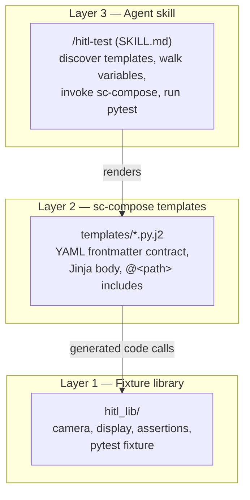
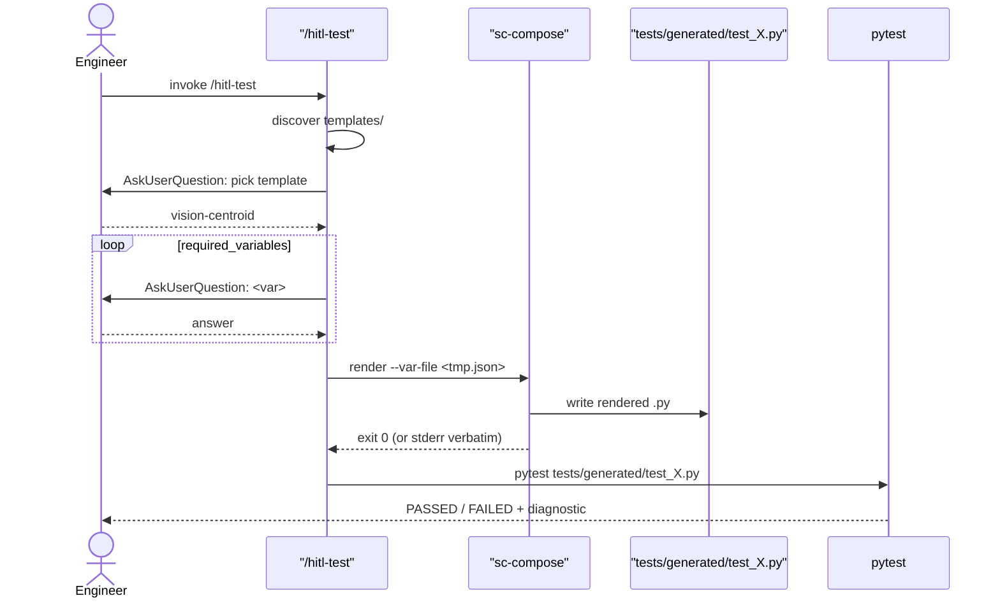

# SOP — Agentic HITL Test Generator

## TL;DR

A test engineer should not have to write Python to specify a hardware test, but the alternative — letting an LLM agent freely emit Python from a natural-language description — produces unaudited, drifting code that's hard to trust. This repo demonstrates a third path: a constrained agent that interrogates the engineer through a fixed set of questions, then renders the answers through a deterministic template into a real test file that exercises a domain-specific fixture library.

Three layers compose: a fixture library (`hitl_lib/`) that mocks hardware behind a narrow API, sc-compose templates (`templates/*.py.j2`) that own structure with a typed-frontmatter contract, and a Claude Code skill (`.claude/skills/hitl-test/SKILL.md`) that runs the conversation. None of the layers is magical — but together they enforce the constraint that every test in CI looks structurally identical, fails loudly when inputs are wrong, and uses house-style fixture calls without anyone having to remember to.

## The three layers



**Layer 1 — `hitl_lib/`.** Plain Python. `camera.capture()` returns a numpy 2D grayscale array; `display.show(pattern)` tracks the current pattern in module state; `assertions.centroid_within(image, target, tolerance_px)` computes the real image-moments centroid and raises a useful `AssertionError`. The fixture (`hitl_lib.fixtures.hitl_fixture`) is registered as a pytest11 entry point so generated tests find it even when written outside the repo's `conftest.py` tree. **No real hardware lives here** — the camera returns a seeded-jitter dot pattern. The point is to mock at the hardware boundary while keeping the math real.

**Layer 2 — `templates/*.py.j2`.** sc-compose templates with YAML frontmatter declaring `required_variables` and `defaults`. Three templates ship: `vision-centroid` (one assertion), `vision-multi-assert` (Jinja `` over parallel scalar arrays), and `smoke-test` (uses sc-compose's literal `@<_shared_setup.j2>` directive to inline shared imports). Templates are reviewable as one file each; their output is reproducible given the same inputs.

**Layer 3 — `/hitl-test`.** A Claude Code skill that discovers `templates/*.py.j2`, asks the engineer which to use, walks the chosen template's `required_variables` via `AskUserQuestion` one at a time, writes answers to a tempfile, invokes `sc-compose render` as a subprocess, and offers to run pytest on the result. The skill does not validate variables itself — sc-compose is the single source of truth.

## Data flow



## What sc-compose actually contributes

The interesting move is **constraining the agent's surface area**. Without sc-compose, the agent freely emits Python — it can invent imports, restructure assertions, miss a `delay_ms` your hardware needs, or write `numpy.median(image)` when your codebase always uses `numpy.mean`. You can prompt against any one of those, but you can't enforce them; the next prompt revision invents a new failure mode.

sc-compose makes the template the contract. The agent fills variable holes; it cannot rename functions, reorder setup, or change the shape of the test. Every `vision-centroid` test in CI is byte-identical except for the five filled-in variables. If the engineer omits a required variable, sc-compose's `ERR_CONFIG_MISSING_VARIABLE` fires before any code runs. If the template changes, all callers pick up the change on next render — review a single template diff instead of fifty generated files.

What sc-compose does **not** do: it has no understanding of what the engineer wants, no UX for collecting inputs, no awareness of the fixture library. Those live in Layers 1 and 3. sc-compose's whole job is rendering text deterministically once the inputs arrive in the right shape.

## Worked interaction

The transcript below shows what `/hitl-test` produces when an engineer asks for a centroid alignment test. Reproduced from the SKILL.md spec at `.claude/skills/hitl-test/SKILL.md` — run the skill yourself to verify (Claude Code session in this repo, type `/hitl-test`).

```
Engineer: /hitl-test

/hitl-test: I see three templates here. Which one are you running?
  ▸ vision-centroid — Vision centroid alignment test (Recommended)
    vision-multi-assert — Multi-assertion test, loops over a list
    smoke-test — Minimal device-alive check
Engineer: vision-centroid

/hitl-test: What should we call this test? (snake_case)
  ▸ grid_centroid_alignment (Recommended)
    centroid_within_tolerance
    quick_smoke
Engineer: grid_centroid_alignment

/hitl-test: Which pattern should the display show?
  ▸ dot_grid — lands ~3.16 px off (100, 100) (Recommended)
    checkerboard — lands ~1.4 px off
    single_dot — lands ~4.2 px off
    horizontal_lines — lands ~2.2 px off
Engineer: dot_grid

/hitl-test: What x-coordinate should the centroid land at?
  ▸ 100 (image center) (Recommended)
Engineer: 100

/hitl-test: What y-coordinate?
  ▸ 100 (Recommended)
Engineer: 100

/hitl-test: How many pixels of tolerance?
  ▸ 5 — passes with default jitter (Recommended)
    2 — tight; will fail
    1 — very tight; fails
    10 — loose; passes everything
Engineer: 5

/hitl-test: Rendered tests/generated/test_grid_centroid_alignment.py.
Run pytest on it now?
  ▸ Yes — run it (Recommended)
    No — I'll run it later
Engineer: yes

============================= test session starts ===============================
tests/generated/test_grid_centroid_alignment.py::test_grid_centroid_alignment PASSED
============================== 1 passed in 0.03s ================================
```

Re-running with `tolerance_px=1` produces:

```
FAILED  AssertionError: centroid (97.00, 101.00) is 3.16px from target (100, 100);
        tolerance was 1px
```

Same template. Different number. Different outcome. The engineer can feel the variable through the failure message.

## Manual walkthrough checklist

The skill is LLM-mediated — there's no unit test that runs it. After any edit to `SKILL.md`, `templates/`, or `hitl_lib/`:

1. `make test` — full suite green (28 tests).
2. `make demo` — vision-centroid renders, generated test passes.
3. `make demo-multi` — multi-assert renders with two assertion calls, passes.
4. `make demo-smoke` — smoke-test renders with `_shared_setup.j2` inlined, passes.
5. New Claude Code session in this repo → `/hitl-test` → walk one template end-to-end → confirm the AskUserQuestion menus match the SKILL.md spec.
6. Render the same template with a deliberately tight `tolerance_px` (1) → confirm the failure diagnostic names the observed centroid.

`tests/test_skill_doc.py` catches drift between `SKILL.md` and the templates' frontmatter, but it cannot catch UX-quality drift — that's what step 5 is for.

## Extending the pattern to a different domain

The split is what generalizes. Replace `hitl_lib/camera+display+assertions` with whatever your domain's hardware-mock + assertion-helper looks like. Write 3–5 templates that cover the test shapes you actually use. Update `SKILL.md` to know the variable defaults for your domain. Everything else — the discovery, the `AskUserQuestion` loop, the render-and-run flow — is portable.

What you'll keep wherever you take this: a typed contract between agent and code, a place where the contract is reviewed (one template per PR, not fifty generated files), and a failure mode that fires before runtime instead of as a silent test pass.
