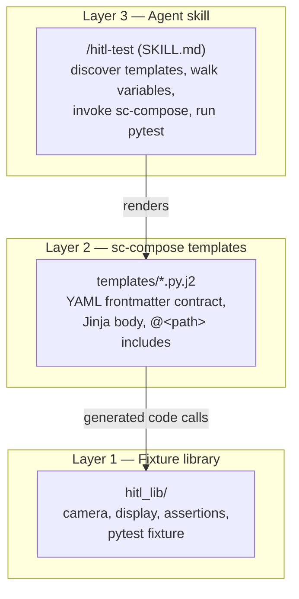
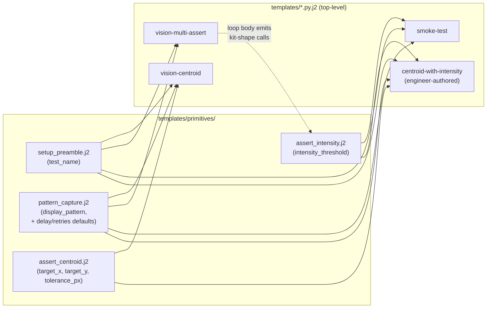
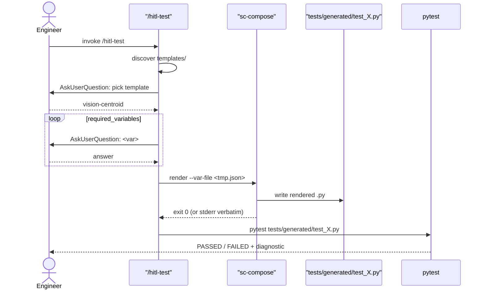

# SOP — Agentic HITL Test Generator

## TL;DR

A test engineer should not have to write Python to specify a hardware test, but the alternative — letting an LLM agent freely emit Python from a natural-language description — produces unaudited, drifting code that's hard to trust. This repo demonstrates a third path: a constrained agent that interrogates the engineer through a fixed set of questions, then renders the answers through a deterministic template into a real test file that exercises a domain-specific fixture library.

Three layers compose: a fixture library (`hitl_lib/`) that mocks hardware behind a narrow API, sc-compose templates (`templates/*.py.j2`) that own structure with a typed-frontmatter contract, and Claude Code skills (`/hitl-test` for consuming templates, `/hitl-author` for authoring new ones) that run the conversation. Templates themselves compose from a small **primitives kit** (`templates/primitives/`) — fragments declaring their own contracts — so that engineer-authored templates are constructed from already-reviewed building blocks rather than free-form Python.

## The three layers



**Layer 1 — `hitl_lib/`.** Plain Python. `camera.capture()` returns a numpy 2D grayscale array; `display.show(pattern)` tracks the current pattern in module state; `assertions.centroid_within(image, target, tolerance_px)` computes the real image-moments centroid and raises a useful `AssertionError`. The fixture (`hitl_lib.fixtures.hitl_fixture`) is registered as a pytest11 entry point so generated tests find it even when written outside the repo's `conftest.py` tree. **No real hardware lives here** — the camera returns a seeded-jitter dot pattern. The point is to mock at the hardware boundary while keeping the math real.

**Layer 2 — `templates/*.py.j2`.** sc-compose templates with YAML frontmatter declaring `required_variables` and `defaults`. Four templates ship: `vision-centroid` (one assertion), `vision-multi-assert` (Jinja `` over parallel scalar arrays), `smoke-test` (minimal device-alive check), and `centroid-with-intensity` (engineer-authored example demonstrating `/hitl-author`'s output). All four compose entirely from the **primitives kit** at `templates/primitives/` via sc-compose's literal `@<primitives/...>` include directive. Templates are reviewable as one file each; their output is reproducible given the same inputs.

**Layer 3 — `/hitl-test` and `/hitl-author`.** Two Claude Code skills with parallel shape. `/hitl-test` discovers `templates/*.py.j2`, walks the chosen template's `required_variables` via `AskUserQuestion`, and renders/runs the result. `/hitl-author` walks an engineer through composing a NEW template from primitives in the kit, writing the composing file to `templates/<name>.py.j2` for developer review. Neither skill validates variables itself — sc-compose is the single source of truth on what counts as a valid input set.

## The primitives kit

Top-level templates aren't authored as monolithic Jinja files; they're **composed from primitives**. A primitive is a fragment at `templates/primitives/<verb>_<noun>.j2` with its own YAML frontmatter declaring exactly what variables it consumes. Each primitive owns one operational concept (setting up the test, capturing an image, asserting one thing). Top-level templates are then mostly a list of `@<primitives/...>` include lines plus their own frontmatter declaring the union of required variables.



sc-compose's FR-3a spec automatically merges `required_variables` across the include graph — including a primitive that needs `display_pattern` means the composing template inherits `display_pattern` as required without having to repeat the declaration. Same for `defaults`, with the composing template winning on conflict.

The kit ships with **four primitives** (the starter set). Adding a fifth is a developer change: new file in `templates/primitives/`, new parametrized entry in `tests/test_primitives.py`, mention in both skills' SKILL.md hint sections. New primitives flow from `issues/primitive-requests/` — files written by `/hitl-author` when an engineer's intent doesn't fit existing primitives.

## Data flow



## Authoring new shapes via `/hitl-author`

`/hitl-author` is the second skill — parallel in shape to `/hitl-test` but for *creating* templates rather than rendering them. The engineer types `/hitl-author`, names their new shape, describes its intent in one line, picks 1–4 primitives from the kit via a multi-select `AskUserQuestion`, answers the variables those primitives require (single source of truth: the SKILL.md spec for variable-walking is `/hitl-test`'s, cross-referenced — not duplicated). The skill then writes `templates/<test_name>.py.j2` containing:

- YAML frontmatter declaring the union of required variables and a `metadata.purpose` derived from the engineer's intent
- An **authoring-trail comment block** at the top of the rendered output recording timestamp, author email, intent, the picked primitives in conventional order, and the "PR before merging" review note
- A body that is `@<primitives/...>` includes in conventional order (setup → capture → assertions)

The authoring-trail block is the demo's central audit moment. The reviewing developer reads it first to understand intent, then reads the include list to confirm the body matches that intent. If the body matches the intent and the primitives are themselves correct, the new template is correct by construction.

When no combination of existing primitives fits the engineer's intent, `/hitl-author` refuses to write a template and instead writes `issues/primitive-requests/<test_name>-YYYY-MM-DD.md` describing what was needed. This is the system's honest answer to novelty: rather than silently approximate, it surfaces the gap.

## The review story

The system depends on **PR review** as the operational gate for both new primitives and engineer-authored templates. This repo doesn't enforce review mechanically — it's a teaching example, not a deployment — but in a real adoption:

- **New primitives** are dev changes. They flow through the normal code-review process: a new file in `templates/primitives/`, an entry in `tests/test_primitives.py`, and an update to both skills' SKILL.md hint sections.
- **Engineer-authored templates** are also reviewed as code, but the reviewer's job is different: compare the authoring-trail comment block against the include list. If the intent says "centroid alignment plus intensity check" and the includes are `setup_preamble + pattern_capture + assert_centroid + assert_intensity`, the review is short. If the intent doesn't match the includes, ask the engineer to re-run `/hitl-author`.
- **Primitive-request files** are dev inputs. They list the engineer's blocked intent in a structured way, so deciding whether to add a primitive is concrete instead of "we should add more."

What this gives up vs. "developers write all templates": engineers can now propose templates themselves, and the bottleneck is review rather than authoring. What it preserves: a typed contract per template, and a place where that contract is reviewed before it can run in CI.

## What sc-compose actually contributes

The interesting move is **constraining the agent's surface area**. Without sc-compose, the agent freely emits Python — it can invent imports, restructure assertions, miss a `delay_ms` your hardware needs, or write `numpy.median(image)` when your codebase always uses `numpy.mean`. You can prompt against any one of those, but you can't enforce them; the next prompt revision invents a new failure mode.

sc-compose makes the template the contract. The agent fills variable holes; it cannot rename functions, reorder setup, or change the shape of the test. Every `vision-centroid` test in CI is byte-identical except for the five filled-in variables. If the engineer omits a required variable, sc-compose's `ERR_CONFIG_MISSING_VARIABLE` fires before any code runs. If the template changes, all callers pick up the change on next render — review a single template diff instead of fifty generated files.

What sc-compose does **not** do: it has no understanding of what the engineer wants, no UX for collecting inputs, no awareness of the fixture library. Those live in Layers 1 and 3. sc-compose's whole job is rendering text deterministically once the inputs arrive in the right shape.

## Worked interaction

The transcript below shows what `/hitl-test` produces when an engineer asks for a centroid alignment test. Reproduced from the SKILL.md spec at `.claude/skills/hitl-test/SKILL.md` — run the skill yourself to verify (Claude Code session in this repo, type `/hitl-test`).

```
Engineer: /hitl-test

/hitl-test: I see three templates here. Which one are you running?
  ▸ vision-centroid — Vision centroid alignment test (Recommended)
    vision-multi-assert — Multi-assertion test, loops over a list
    smoke-test — Minimal device-alive check
Engineer: vision-centroid

/hitl-test: What should we call this test? (snake_case)
  ▸ grid_centroid_alignment (Recommended)
    centroid_within_tolerance
    quick_smoke
Engineer: grid_centroid_alignment

/hitl-test: Which pattern should the display show?
  ▸ dot_grid — lands ~3.16 px off (100, 100) (Recommended)
    checkerboard — lands ~1.4 px off
    single_dot — lands ~4.2 px off
    horizontal_lines — lands ~2.2 px off
Engineer: dot_grid

/hitl-test: What x-coordinate should the centroid land at?
  ▸ 100 (image center) (Recommended)
Engineer: 100

/hitl-test: What y-coordinate?
  ▸ 100 (Recommended)
Engineer: 100

/hitl-test: How many pixels of tolerance?
  ▸ 5 — passes with default jitter (Recommended)
    2 — tight; will fail
    1 — very tight; fails
    10 — loose; passes everything
Engineer: 5

/hitl-test: Rendered tests/generated/test_grid_centroid_alignment.py.
Run pytest on it now?
  ▸ Yes — run it (Recommended)
    No — I'll run it later
Engineer: yes

============================= test session starts ===============================
tests/generated/test_grid_centroid_alignment.py::test_grid_centroid_alignment PASSED
============================== 1 passed in 0.03s ================================
```

Re-running with `tolerance_px=1` produces:

```
FAILED  AssertionError: centroid (97.00, 101.00) is 3.16px from target (100, 100);
        tolerance was 1px
```

Same template. Different number. Different outcome. The engineer can feel the variable through the failure message.

## Manual walkthrough checklist

Both skills are LLM-mediated — there's no unit test that runs them end-to-end. After any edit to either SKILL.md, the primitives kit, the top-level templates, or `hitl_lib/`:

1. `make test` — full suite green (45 tests).
2. `make demo` — vision-centroid renders + passes.
3. `make demo-multi` — multi-assert renders with two assertion calls, passes.
4. `make demo-smoke` — smoke-test renders (now composes from primitives) and passes.
5. `make demo-authored` — engineer-authored example template renders and passes; the authoring-trail comment block appears at the top of `tests/generated/test_authored.py`.
6. Render `vision-centroid` with `vars.tight.json` (`tolerance_px=1`) → confirm the failure diagnostic names the observed centroid `(97.00, 101.00)` and distance `3.16px`.
7. New Claude Code session in this repo → `/hitl-test` → walk one template end-to-end → confirm the AskUserQuestion menus match `.claude/skills/hitl-test/SKILL.md`.
8. New Claude Code session in this repo → `/hitl-author` → author a throwaway template using 2–3 primitives → confirm the authoring-trail block survives sc-compose rendering and the generated file is discoverable by `/hitl-test`.
9. New Claude Code session → `/hitl-author` → indicate "none of the primitives fit" → confirm a file lands in `issues/primitive-requests/`.

`tests/test_skill_doc.py` + `tests/test_hitl_author_doc.py` catch drift between SKILL.md files and the kit/template contracts, but they cannot catch UX-quality drift — that's what steps 7–9 are for.

## Extending the pattern to a different domain

The split is what generalizes. Replace `hitl_lib/camera+display+assertions` with whatever your domain's hardware-mock + assertion-helper looks like. Write 3–5 primitives that cover the operational concepts your tests are built from (the equivalents of `setup_preamble`, `pattern_capture`, `assert_centroid`, `assert_intensity`). Build a handful of top-level templates that compose from those primitives. Update both SKILL.md files (`hitl-test` and `hitl-author`) to know the variable defaults for your domain.

Everything else — primitive discovery, the `AskUserQuestion` loop, the render-and-run flow, the authoring-trail block, the primitive-request file format — is portable. The four-primitive kit and two skills you see here are the *minimum* expression of the pattern; richer domains will have more primitives, and possibly intermediate "composite" primitives (one primitive that includes others) for common combinations.

What you'll keep wherever you take this: a typed contract between agent and code, a kit of reviewed building blocks the agent can compose from but not bypass, a place where each contract is reviewed (one template per PR, not fifty generated files), and a failure mode that fires before runtime instead of as a silent test pass.
